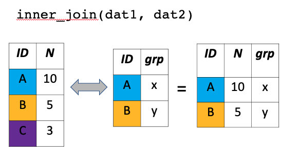
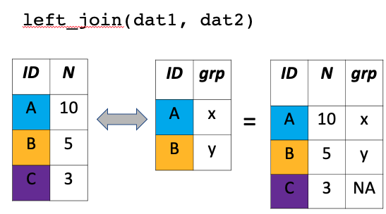
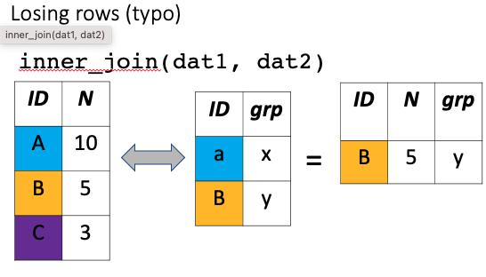
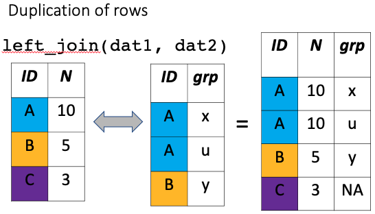
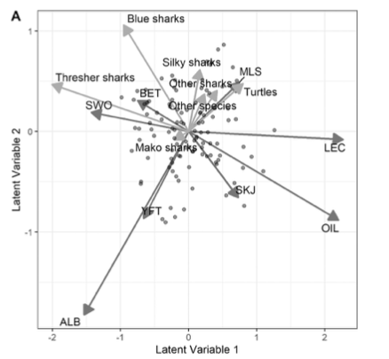

```{r setup, include=FALSE}
knitr::opts_chunk$set(echo = TRUE, warning = FALSE, message = FALSE)
```


([QUICK LINK TO GET THE DATA](https://github.com/cbrown5/SDM-fish-course-notes/raw/main/data.zip))

Who am I? 

[Chris is a Senior Lecturer](https://experts.griffith.edu.au/7867-chris-brown/publications) at Griffith University and an Australian Research Council Future Fellow. Chris and his team in the [Seascapemodels](https://www.seascapemodels.org/) lab work on the conservation of ocean ecosystems and sustainable management of fisheries. His team uses advances in statistical modelling approaches to synthesize ecological data and inform environmental decision making. 

Chris' career was built with R's open-source tools. He is paying forwards that favour by [creating free R resources](https://www.seascapemodels.org/code.html) and teaching workshops far and wide. 

# Introduction 


R is the leading programming language for ecological modelling for good reason. Being free and open-source certainly helps. Having strengths in dataviz also helps. And because of these traits, R now has a huge ecosystem of user-contributed packages that enable sophisticated modelling applications. 

This ecosystem of R packages is created by a huge community of R users, many of whom are leaders in their field developing cutting edge statistical models and data science tools. This means if you know R, you can access cutting edge tools and combine them in new ways. 

While there are other languages that excel for scientific computing, R owns the market in species distribution modelling (SDMs), the topic of this course. 

Until quite recently most R users would prepare their data outside of R (e.g. in Arc GIS) and then read it into R for the SDM. But R now also has efficient and user friendly GIS and mapping packages. This means you can create your entire SDM workflow, from data download to visualization, in R. 

But starting an SDM project in R can be daunting for new users. There is a steep learning curve for coding, and there are so many options for packages it is easy to get decision paralysis. 

So in this course we are going to provide an introduction to some common SDMs in R. We will also learn how to build an efficient workflow. Our goals today are:

1. Overview R's capability for GIS and spatial dataviz  

2. Learn how to build efficient and repeatable workflows for SDMs  

3. Learn how to run some SDMs  

4. Learn how to visualize spatial data and SDM results   

This course is suitable for people who have some R experience. It is not a beginners course, but users with a little bit of R experience can follow through the first few sections. 

## Methods we will cover

In this course we'll overview: 

- GIS in R with shapefiles and rasters (using the modern packages `sf` and `terra`)

- Generalized linear models 

- Generalized least squares and models of spatial autocorrelation

- Generalized additive models 

- Spatial prediction and interpolation 

## What you'll need 

Make sure you have a recent version of R (available at the CRAN website) and Rstudio installed (free desktop version is fine). 

You will need to install these packages: 

```{r, eval=FALSE}
install.packages(c("tmap", "tidyverse", "terra",
                   "sf", "nlme",
                   "patchwork", "visreg"))

```

[You will also need to download the data for the course](https://github.com/cbrown5/SDM-fish-course-notes/raw/main/data.zip). 


## Case-study: Bumphead parrotfish, 'Topa' in Solomon Islands

Bumphead parrotfish (*Bolbometopon muricatum*) are an enignmatic tropical fish species. Adults of these species are characterized by a large bump on their forehead that males use to display and fight during breeding. Sex determination for this species is unknown, but it is likely that an individual has the potential to develop into either a male or female at maturity. 

Adults travel in schools and consume algae by biting off chunks of coral and in the process they literally poo out clean sand. Because of their large size, schooling habit and late age at maturity they are susceptible to overfishing, and [many populations are in decline](https://doi.org/10.1007/s00338-019-01801-z). 

Their lifecycle is characterized by migration from lagoonal reef as juveniles (see image below) to reef flat and exposed reef habitats as adults. Early stage juveniles are carnivorous and feed on zooplankton, and then transform into herbivores at a young age. 


Image: Lifecycle of bumphead parrotfish. Image by E. Stump and sourced from [Hamilton et al. 2017](http://dx.doi.org/10.1016/j.biocon.2017.04.024). 

Until the mid 2010s the habitat for settling postlarvae and juveniles was a mystery. However, the pattern of migrating from inshore to offshore over their known lifecycle suggests that the earliest benthic lifestages ('recruits') stages may occur on nearshore reef habitats. 

Nearshore reef habitats are susceptible to degradation from poor water quality, raising concerns that this species may also be in decline because of pollution. But the gap in data from the earliest lifestages hinders further exploration of this issue. 

In this course we'll be analyzing the first survey that revealed the habitat preferences of early juveniles stages of bumphead parrotfish. These data were analyzed by [Hamilton et al. 2017](http://dx.doi.org/10.1016/j.biocon.2017.04.024) and [Brown and Hamilton 2018](http://dx.doi.org/10.1111/cobi.13079). 

In the 2010s Rick Hamilton (The Nature Conservancy) lead a series of surveys in the nearshore reef habitats of Kia province, Solomon Islands. The aim was to look for the recruitment habitat for juvenile bumphead parrotfish. These surveys were motivated by concern from local communities in Kia that topa (the local name for bumpheads) are in decline. 

In the surveys, divers swam standardized transects and searched for juvenile bumphead in nearshore habitats, often along the edge of mangroves. All together they surveyed 49 sites across Kia. 

These surveys were made all the more challenging by the occurrence of crocodiles in mangrove habitat in the region. So these data are incredibly valuable. 

Logging in the Kia region has caused [water quality issues that may impact nearshore coral habitats](http://dx.doi.org/10.1111/cobi.13079). During logging, logs are transported from the land onto barges at 'log ponds'. A log pond is an area of mangroves that is bulldozed to enable transfer of logs to barges. As you can imagine, logponds are very muddy. This damage creates significant sediment runoff which can smother and kill coral habitats. 

Rick and the team surveyed reefs near logponds and in areas that had no logging. They only ever found bumphead recruits hiding in branching coral species. 

In this course we will first ask if the occurrence of bumphead recruits is related to the cover of branching coral species. We will then develop an SDM to analyse the relationship between pollution from logponds and bumphead recruits, and use this SDM to predict pollution impacts to bumpheads across the Kia region. 

The data and code for the original analyses are [available at my github site](https://github.com/cbrown5/BenthicLatent). In this course we will use simplified versions of the original data. We're grateful to Rick Hamilton for providing the data for this course. 

## Planning our project 

An important part of R coding is having an organized workflow. Being organized is important in anything more complex than a one-step R program, which will be most projects involving SDMs. Organizing your workflow requires forward planning and sticking to some strategies. In this course we'll follow a simple workflow. 

There are multiuple benefits of an organized workflow. You code will be more transparent and repeatable, this will benefit both future you and other researchers. It also means you are less likely to make mistakes and the code is easier to debug when you do. Finally, you may want to share the code publicly so other people can repeat your work. 

First, you'll want to identify your research question. If your question is clear then you can stick to what you need to do, and not end up going down rabbit holes creating code you won't use. Once you have that question I recommmend considering fives steps in your workflow: 

### 1. Gather the data 

You will need to source data, often from online data repositories. Even if you have collected species observations yourself, you will likely need to get environmental covariates for prediction from sources such as weather bureaus, oceanographic repositories or climate models. 

### 2. Data wrangling 

The data needs to be read into R and 'wrangled' into the appropriate data structure for the modelling packages you will use. Just a warning, some packages require different data structures, so make sure you know what you want! For a spatial model this step can involve a lot of (complex) GIS. Thankfully, R has good packages for GIS. 

### 3. Dataviz 

Before starting I always use R's powerful data visualisation tools to explore the data. This gives you a deeper understanding of what you'll model, can help avoid conceptual flaws. Also, you may want to save some data plots for your publication. In this course we'll use R markdown to make a report on our data that can be easily shared with collaborators. 

### 4. Modelling  

Finally, we get to the modelling. This is where we'll spend most time in this course 


### 5. Modelviz  

A powerful way to communicate your models is by making more dataviz. In this course we'll use dataviz look at what the models say are important environmental drivers of fish abundance, and see how we can use the model to make predictions to unsampled sites. 

One final note, the above can be an iterative process. But organize your R scripts like the above and it will be much easier. 

## Lets get started 

So that's all the background, let's get started. We'll work through each step of the above workflow. 

# Setting up your project folder 

Start up Rstudio. I recommend setting up each project as an Rstudio project. Click File>New Project and follow the prompts to create a New project directory. Then drop the data folder into this directory (and make sure you unzip it). 

Also create subdirectories for 'images' and 'scripts', this is where we'll save images and R scripts respectively. 

For complex projects you'll want to create other subfolders to keep organized. e.g. I often have a folder for documents and a folder for model outputs. 

Now whenever you want to work on this project double click the .Rproj file. It will open Rstudio in this working directory (so you never need use `setwd` again!). 

With the project open create a new R script (File>New File>R Script) and save it in the scripts folder. We'll now write our R code in this script.

Just double check your are in the top level working directory by typing `getwd()` into the console. If you opened the .RProj file you will be already there. If you are not, navigate there (e.g. with Session>Set Working Directory). 

# 1. Gather the data 

## Where do I get data for SDMs from? 

You should have the data for this course already, if not [download it from github](https://github.com/cbrown5/SDM-fish-course-notes/raw/main/data.zip). 

Data for SDMs can come from many sources. The response variable is of typically species, presence, abundance or biomass. This data may come from your own surveys, those of collaborators, online repositories, government agencies or NGOs. Examples of data sources include fisheries surveys and citizen science programs. 

You'll also want some covariates, which we'll use for predicting the species. These may be included with the data, but are often obtained from other sources. For instance, the ['Australian Ocean Data Network'](https://portal.aodn.org.au/) has a huge amount of different ocean data sources all available to researchers for free. In my state the Queensland government also has repositories of geographic datasets that can be downloaded. Other states and countries have similar services. 

There are specialized R packages for accessing environmental data, such as [rnaturalearth](https://cran.r-project.org/web/packages/rnaturalearth/README.html). The [rLandsat](https://github.com/atlanhq/rLandsat) can directly download landsat data from the USGS and help you process it. 

Other common data sources include [UNEP](https://data.unep-wcmc.org/) and [Exclusive Economic Zones](https://www.marineregions.org/downloads.php). 

If you know the data you want, try websearches 'r landsat' or 'r packages landsat' to see if there is a package available to ease the task fo getting the data in an R friendly format. 

If not try search the data type and 'download' or 'shapefile' (for spatial data). 

Another strategy is to look at peer-reviewed papers doing similar analyses and see what data sources they cite.  

For this course I've already provided you with the data, so let's get started on reading that into R. 

## Reading simple dataframes 

First we'll need a few packages for data reading and initial data 
```{r}
library(readr)
library(ggplot2)
library(dplyr)
```

We will load in the data using a package from the tidyverse called `readr`. `readr` is handy because it does extra checks on data consistency over and above what the base **R** functions do. Data frames imported by `readr` also print in summary form by default.

Now can read in the fish survey data: 

```{r}
dat <- read_csv("data/JuvUVCSites_with_ReefTypes_16Jun2016.csv")
names(dat)
nrow(dat)
length(unique(dat$site))
range(dat$pres.topa)
```  
Its worthwhile taking a look at it with `View(dat)` and doing some other exploration in addition to that above such as with `summary(dat)` or `str(dat)`. Always check your data carefully, both on initial load and throughout your analyses. 

With this data I had a major issue with site names (which were in a local language) being spelt differently in different datasets. This resulted in mismatches and some sites being lost when I did my first take on the analysis. Never assume data someone gives you are absolutely clean. 

There are coordinates in the data we just read, but because this is a basic dataframe there is no coordinate reference system (CRS)! Without a CRS we don't know where on earth these coordinates map to, and can't align them with other datasets. Thorough documentation of metadata is really important. The CRS is something to make sure you ask data providers (or provide the files as spatial files).   

It’s often easier to explore data with graphics. R is really great for graphics. R has good base packages for graphics, but we’ll use Grammar of Graphics 2 today (`ggplot2`).

The theory of ggplot is that you build you plot up in a series of layers. Each layer is created by a specific function and we string them together with a +. Here’s an example:

```{r}
ggplot(dat) + 
  aes(x = secchi, y = pres.topa) + 
  geom_point() + 
  stat_smooth()
```

This makes a histogram. The ggplot(dat) declares the dataframe from which we’ll draw variables and also creates the page for the plot. The aes stands for aesthetics for the plot, here we use it to declare an x axis which is the variable Abundance of topa (`pres.topa`). Then geom_points declares a geometry object which decides how the aesthetics are plotted to the page. 

We've also added a trend line with `stat_smooth()`. 

Let's do a boxplot too: 

```{r}
ggplot(dat) + 
  aes(x = logged, y = pres.topa) + 
  geom_boxplot()
```

I don't much like ggplot's default theme, so I'll change that now: 

```{r}
theme_set(theme_classic())
```

There are other themes available, you can do a web search if you are interested. 

Let's also read the benthic data and explore that: 

```{r}
bendat <- read_csv("data/BenthicCoverSurveys.csv")
nrow(bendat)
head(bendat)
range(bendat$cover)
```
Many more than 49 rows (one per site) here. Try `table(bendat$category)` to see what's going on.  

```{r}
ggplot(bendat) + 
  aes(x = category,y = cover) + 
  geom_boxplot() + 
  theme(axis.text.x = element_text(angle = 90))
```

## Reading spatial data 

We'll use `sf` package for reading spatial data. 

`sf` stands for 'simple features' and is an open standard for geospatial databases. Interfaces using the simple features standard are available in many GIS programs. For **R** we need the package `sf`. 

A good introduction to `sf` can be found in [Geocomputation in R](https://geocompr.robinlovelace.net/), which is free online. 

In the spatial analysis in **R** was usually done with the `sp` package, which uses a different (and less convenient) paradigm for databases. You may still have to use that sometimes when `sf` doesn't play nicely with other packages. Eventually `sf` will replace `sp`, so we will be teaching `sf` today. 

### Reading spatial points

```{r}
library(sf)
logponds <- st_read("data/Kia_Logging_Ponds/Kia_Logging_Ponds.shp")
names(logponds)
```

The logponds is just like a dataframe, but with coordinates associated to each row and meta-data (e.g. the CRS) as well. 

Note the field 'Projected Coordinate System'

### An aside on coordinate reference systems 

`crs` stands for **Coordinate Reference System**. 

To see it type

```{r eval=FALSE}
st_crs(logponds)
```

What is a coordinate reference system? Well the earth is spherical. So at the very least, we'd need a 3 dimensional coordinate system and a reference point to accurately map locations on the Earth's surface. 

But our maps are plotted in 2 dimensions. So we need to decide how to 'project' the 3 dimensions onto 2. There are many ways to do the projection they are called 'projections'. Projections are given using a standardized code called a WKT (meaning well known text, which I find ironic). 

We also need to say how those coordinates relate to the spherical shape of the earth. 

To do that, we first need a model to describe the spherical surface of the earth. The earth is lumpy and fatter at the equator than a perfect sphere, because of its spin. 

There are a few ways to model Earth's lumpy shape, they are called ellipsoids. In our case, the WGS84 datum uses a global standard ellipsoid, which was developed in the last few decades with accurate GPS measurements. 

The datum tells us how the coordinates relate to the ellipsoid (e.g. it is a reference to the centre point of the earth).

We can also specify the CRS with an EPSG, which is a shorthand code that refers to the specific proj4string (e.g. EPSG 4326 is a common code for unprojected lon/lat coordinates). 

If you want to learn more about projections, try [this blog](
https://www.sharpgis.net/post/2007/05/05/Spatial-references2c-coordinate-systems2c-projections2c-datums2c-ellipsoids-e28093-confusing). 

If you stuff up your CRS you'll know when you zoom in and you see different layers are misaligned. Its not that uncommon to be provided with spatial data with missing or incomplete CRS. This can be a real headache. 


### Reading polygons

Reading polygons is just as easy as points. 

```{r}
land <- st_read("data/LandPoly/LandPoly.shp")
plot(land[1])
```

Now each row is associate with a polygon (different islands). 

# 2. Data wrangling 

What's the deal with spatial 'data wrangling'  

The modern quantitative scientist has to know a lot more about working with databases and data analysis than in the past. Scientists are increasingly integrating a large variety of spatial data-sets into their work. These analyses require matching data-sets that may have been entered in different ways, or cover different temporal and spatial scales. 

All of these procedures can be termed data wrangling. We are going to skim over some R tools that can be used for wrangling of spatial data. I also run a specialist course just on this topic, and the notes are [available for free on my webpage](https://www.seascapemodels.org/code.html). 

As expert **R** users we have often been faced with situations where a collaborator has asked us to 'just run some numbers' on a dataset, and be rewarded with an 'easy' paper. 

'Easy' is often far from the truth. And the time-consuming part isn't the stats. It's the cleaning of the data that takes a lot of time. And then often we need to match up the new data to existing data-sets, such as when we want to know whether the spatial distribution plankton correlates with ocean temperature. 

If you have to deal with large data-sets you may realise that data wrangling can take a considerable amount of time and skill with spreasheets programs like excel. Data wrangling is also dangerous for your analysis- if you stuff something up, like accidentally deleting some rows of data, it can affect all your results and the problem can be hard to detect.

So let's get started with some data wrangling. 

## Summarizing benthic cover data 

First thing I want to do is make a variable for cover of branching corals. We could filter ACB (acropora branching) from our benthic surveys like this: 

```{r}
CB_dat <- filter(bendat, code == "ACB")
```

But Bolbometopon can use both ACB and CB (coral branching, though they seem to prefer certain species of acropora!). To filter for CB and ACB I'll use the `%in%` operator, which just asks at which rows does one variable match one of a set of another variable:  

```{r}
CB_dat <- filter(bendat, code %in% c("ACB", "CB"))
```

Now we can `group_by` sites and summarize to sum cover over those two benthic categories: 

```{r}
CB_dat <- group_by(CB_dat, site)
CB_dat <- summarize(CB_dat, CB_cover = sum(cover),
                    n_pts = mean(n_pts))
```

## Pipes for more readable workflows 

Pipes are a tool that allow us to elegantly code data wrangling steps into a series of sequential actions on a single data frame. When used properly, pipes allow us to implement the same wrangling steps with less code.

In this course we've learned how to use quite a few dplyr functions for data wrangling, including: 'filter', 'group_by' and 'summarize'. So far we've coded each of those functions as separate steps. Let's look at how pipes can be used to code all of those sequentially in a single line of code. We'll do same as above but use pipes to create a combined benthic variable for sand/silt: 

```{r}
soft_dat <- bendat %>%
  filter(code %in% c("S", "SI")) %>% #Sand or Silt
  group_by(site) %>% 
  summarize(soft_cover = sum(cover),
                    n_pts = mean(n_pts))
```

## Joining dataframes for fish and benthic data 

We can now join our dataframes: 

```{r}
nrow(dat)
dat2 <- left_join(dat, CB_dat, by = "site")
nrow(dat2)
dat2 <- left_join(dat2, soft_dat, by = c("site", "n_pts"))
nrow(dat2)
``` 

**Joins are a very important but very dangerous data wrangling operation!** You must always choose your join type carefully. For instance, `inner_join` vs `left_join` vs `full_join` will all give the same result for some datasets, but not others. 

Even after you think you know what you are doing, you still need to check the outcome. As we explained above, you can lose samples that don't match, or duplicate samples that match multiple times. I (CB) have made (and thankfully corrected) this mistake many times, often because of small inconsistencies in the data I was provided, like when some site names have all lower case, and a handful have title case. 

We don't say this to put you off joins, they are one of the most useful data wrangling tasks you can do in R, but just be careful. 

Here are some images to explain how joins work. 




**And mistakes to watch for** losing data: 



Or duplicating data: 



### Plotting benthic and fish data 

One way to check the join worked is to plot the outputs: 

```{r}
ggplot(dat2) + 
  aes(x = logged, y = CB_cover) + 
  geom_boxplot()
```

```{r}
ggplot(dat2) + 
  aes(x = CB_cover, y = pres.topa) + 
  geom_point()

```


```{r}
ggplot(dat2) + 
  aes(x = CB_cover, y = soft_cover) + 
  geom_point()

```

### Exploring correlations in our data 

It's useful to know about correlations to see where they may be relationships, but also where variables might be confounded:  

```{r eval=FALSE}
icol <- sapply(dat2, is.numeric)
pairs(dat2[,icol])
round(cor(dat2[,icol]),2)
```

Which could also be summarized as a `corrplot`:

```{r}
icol <- sapply(dat2, is.numeric)
library(corrplot)
corrplot(cor(dat2[,icol]))

```

## Creating spatial points files 

We should also convert our survey dataframe to a spatial layer: 

```{r}
kia_crs <- st_crs(logponds)
sdat2 <- st_as_sf(dat2, coords = c("coordx", "coordy"),
                  crs = kia_crs)
plot(sdat2["pres.topa"])
```
There's a bit to explain here in this simple step. 

`st_as_sf` is the function that converts different data types to simple features. Try `?st_as_sf` to see what else it can convert. `dat2` is our original data. The `coords` bit just gives the names of the columns that relate to the spatial coordinates (in order of X coordinate followed by Y coordinate). 

We've also specified the CRS, using the same CRS as the logponds data. 

## Spatial data wrangling: transforming CRS

Now we should check all our data has the same CRS, before we plot them as layers on a map: 

```{r}
st_crs(land) == kia_crs
```

We can correct the CRS of land to that of the logponds like this: 

```{r}
land <- st_transform(land, kia_crs)
st_crs(land) == kia_crs
```  

## Spatial data wrangling: distances 

Now we want to know if pollution from logponds affects coral and fish. But we have no direct measurements of pollution at sites. We could use distance to logponds as a proxy for pollution. 

First we make a matrix of distances from every sample site to every logpond: 

```{r}
distmat <- st_distance(sdat2, logponds)
dim(distmat)
```

Now for each site (rows) find the nearest (minimum) distance: 

```{r}
apply(distmat, 1, min)[1:5]
```

The row order is preserved in distmat, so we can simply assign this min distance back to the `sdat2` dataframe: 

```{r}
sdat2$dist_to_logging <- apply(distmat, 1, min)/1000

ggplot(sdat2) + 
  aes(x = dist_to_logging, y = pres.topa) + 
  geom_point()
```
We `/1000` so units are now in km (remember this for later). 

There's a big caveat with these distances though, can you guess what it is? 

[Here's a blog explaining some different options for calculating distances](https://www.seascapemodels.org/rstats/2020/02/08/calculating-distances-in-R.html). 

At this point we have clean and polished dataset. So it'd be a good idea to save the key datafiles and start a new script for the next phase. e.g. I would do that as an rda (r data) or RDS file:

```{r}
save(sdat2, dat2, land, logponds, kia_crs, 
     file = "outputs/2021-09-20_cleaned-data.rda")
```

# 3. Dataviz 

If you are starting a new script, reset your workspace (e.g type this into console, or restart R studio): 

```{r}
rm(list = ls())
```

Now in your script, load your packages again and read your data file in: 

```{r}
library(dplyr)
library(sf)
library()
load("outputs/2021-09-20_cleaned-data.rda")
```

I would call this script something like `2_dataviz.R`, so the order of scripts is clear. 

As you'll see we've already done a lot of dataviz, but now we'll make finished products for using in a report or publication. 

### Combining multiple plots 

patchwork is a fun way to do this task

```{r}
library(patchwork)
```

First we save each ggplot as an object, that can be printed on demand: 


```{r}
g1 <- ggplot(sdat2) + 
  aes(x = dist_to_logging, y = secchi) + 
  geom_point() + 
  stat_smooth()
g1
```

```{r}
g2 <- ggplot(sdat2) + 
  aes(x = dist_to_logging, y = CB_cover) + 
  geom_point() +
  stat_smooth()

g3 <- ggplot(sdat2) + 
  aes(x = CB_cover, y = pres.topa) + 
  geom_point() + 
    stat_smooth()

```

Now use `+`, `/` and `()` to arrange your plots into a patchwork: 

```{r}
gall <- g1 + g2 + g3
gall
``` 

Finally, you can save the image: 

```{r eval=FALSE}
ggsave("plot1.png", gall, width = 8, height = 3)
```

### Making maps

I like to use `tmap` for maps. 

`tmap` works much like `ggplot2` in that we build and add on layers. In this case we have just one layer, from `sdat2`. We declare the layer with `tm_shape()` (in this case `sdat2`), then the plot type with the following command. 

Here we are using `tm_symbols` to plot dots of the coordinates. Other options are `tm_polygons`, `tm_dots` and many others we'll see later.  

We've picked the column `"pres.topa"` for the colour scale. 

```{r}
library(tmap)
```

```{r}
tm_shape(sdat2) + 
  tm_symbols(col = "pres.topa", size = 0.2)
```

We can also save tmap layers, e.g. the layer for land will come in handy later: 

```{r}
tland <- tm_shape(land) + 
  tm_fill()
```

Now we can layer land and the survey sites: 

```{r}
tland + 
  tm_shape(sdat2) + 
  tm_symbols(col = "pres.topa", size = 0.2) +
  tm_scale_bar(position = c("right", "top"))
```
(Read more about tmap in the package vignettes](https://cran.r-project.org/web/packages/tmap/vignettes/tmap-getstarted.html). 

# 4. Modelling  

You might like to start another script here and call it `3_modelling.R`. 

## Choosing an SDM 

Species distribution modelling is a huge research field and there are many options for choosing an SDM. I classify SDMs into two types: model based approaches and machine learning (algorithm) based approaches. In this course we'll look at model based approaches, but first a brief overview. 

#### Machine learning (algorithm) based approaches

These approaches gained popularity in the 00s with algorithms such as boosted regression trees (check out Jane Elith's papers) and maxent. They are very flexible in terms of data they can fit, and can have excellent predictive power. But on the downside they 'black boxes' and it can be hard for humans to interpret why they make good predictions.

#### Model based approaches

Model based approaches fit models to data. I prefer to use model-based approaches because they let me interpret the results (e.g. how does a species respond to increasing temperature?). Model approaches also are better at estimating and representing uncertainty bounds than machine learning approaches. Finally, model based approaches let us deal directly with spatial autocorrelation. Dealing with spatial autocorrelation is essential for most spatial ecological datasets. 

Another issue that commonly arises (that I won't deal with here) is imperfect detection of species. Model based approaches can handle this. 

Notably, a recent study suggests that machine learning approaches have drastically overstated predictive ability, because [they have not dealt with spatial autocorrelation](https://www.nature.com/articles/s41467-020-18321-y). 

#### Hybrid approaches 

There's always a grey area to any dichotomy. More recent SDMs develoments are utilizing neural network (machine learning) to fit complex multispecies and process-based models. 

Check out the R package [`mistnet`](https://rdrr.io/github/davharris/mistnet2/man/mistnet.html) for one example. A new development is Joseph's ['neural hierarchical models'](https://mbjoseph.github.io/posts/2020-01-13-neural-hierarchical-models/) (implemented in the python language) which apply machine learning to train process models of multi-species communities. 


#### Comparison of some different SDM options 

```{r echo = FALSE}
datmodels <- read_csv("model-types.csv")
knitr::kable(datmodels)
```
*Note that point process models are [mathematically equivalent to maxent](https://onlinelibrary.wiley.com/doi/abs/10.1111/j.1541-0420.2012.01824.x) and can be implemented with many packages, e.g. [INLA pkg's SPDE approach](https://becarioprecario.bitbucket.io/spde-gitbook/ch-lcox.html)

#### Some examples 

The effects of heatwaves on corals are well known, but what about direct effects on fish? 

[In a recent study](https://onlinelibrary.wiley.com/doi/abs/10.1111/gcb.15472) I wanted to know how fish catch related to fish abundance and environmental variables, notably temperature. This was a spatial and temporal model of fish catch. I developed a Bayesian hierarchical model with the [`brms` pkg](https://cran.r-project.org/web/packages/brms/index.html). brms let me develop a bespoke model of catch as it related to inwater fish biomass and heatwaves. 

Importantly, I could also model for uncertainty in the predictor variable of fish biomass (something non-Bayesian models have a hard time doing). The results suggested that coral trout were easier to catch during a heatwave. 

Tuna longline fisheries can have high bycatch of threatened species, like turtles and sharks. Understanding how bycatch relates to environmental variables, but also target fish species can help us design more effective regulations for avoiding bycatch. [We used multispecies distribution models ](https://doi.org/10.1016/j.marpol.2021.104664) (AKA joint models) to study catch of target tuna and bycatch in several longline fisheries. Models were implemented [with boral pkg in R](https://cran.r-project.org/web/packages/boral/boral.pdf). 

The results revealed clusters of bycatch that were associated with certain fishing practices and targeting of certain tuna species (notably yellowfin over bigeye). 


Image: Ordination of catch and bycatch in the longline sets from Palau longline tuna fishery. The ordination was made from a joint model 'boral' ([Brown et al. 2021](https://doi.org/10.1016/j.marpol.2021.104664))

Finally, [for our analysis of bumphead parrotfish](http://dx.doi.org/10.1016/j.biocon.2017.04.024) I used path analysis. This can be done with the [piecewiseSEM](https://cran.r-project.org/web/packages/piecewiseSEM/index.html) package. Path analysis is great for inference on causes of change (but not so powerful for prediction in my experience). The path analysis suggested that bumphead were in decline both from loss of habitat, but also direct effects of water quality on the fish themselves. 


#### How to decide what model to use? 

Here are some good questions to ask

- Am I most interested in inference?  
If yes avoid machine learning approaches 

- Is it important to represent uncertainty in outputs? 
If yes avoid machine learning approaches and preference Bayesian approaches

- Is spatial AC a problem? 
Answer is almost certainty yes, see table above for options. 

- Are there non-linear relationships? (probably yes)
Answer is almost certainty yes, use more flexible approaches like machine learning GAMs (and Bayesian approaches). 

- Do I want to implement bespoke model formulas?  
If yes, use Bayesian approaches 

- How long can I wait for a model computations ? 
If its <1 minute then avoid Bayesian approaches (or use INLA, which is very fast)

- What is my technical capability? 
If your just starting out use GLMs or GAMs. If you want to go Bayesian, an easy start is brms or hmsc for multispecies models 

## Preparation 

So now we've covered some modelling options, let's do some modelling. 

We are going to start with simpler models and work our way through. In a real workflow you might do things differently. For a complex analysis its good to start simple. Whereas for a straightforward GLM you might start with the most complex model including all covariates and work your way backwards to simplifying it. 

First up I'll take the log of distance to log ponds and use the log as our covariate in the model. Why am I using? 

```{r}
sdat2$log10_dist_logging <- log10(sdat2$dist_to_logging)
```

log10 is good, because its units are easier to interpret than LN. I'm taking the log because I expect pollution effects to be most concentrated near to ponds. You'll see that below. 

Another good question is why use distance to logging when we have measured coral cover and we think it has a more direct influence on topa recruits? 

#### Generalized linear model

[If you need to quickly learn the basics of GLMs start here](https://www.seascapemodels.org/rstats/2018/01/19/intro-to-glms.html) then [read this article on link functions](https://www.seascapemodels.org/rstats/2018/10/16/understanding-the-glm-link.html)

We'll start with a GLM. `visreg` is a great package for visualising

```{r}
library(visreg)
```

Let's do a normal (gaussian) GLM. We'll use the `flow` variable too, its an indicator of whether the site had strong or mild current flows. Sites with strong flows should have better water quality.  

```{r}
glm1_gaus <- glm(pres.topa ~ log10_dist_logging + flow, data = sdat2)
par(mfrow = c(2,2))
plot(glm1_gaus)
```

Looks like normal distribution isn't appropriate (what did I say!). Poisson distribution is often good for counts: 

```{r}
glm1_pois <- glm(pres.topa ~ log10_dist_logging + flow, data = sdat2,
          family = "poisson")
par(mfrow = c(2,2))
plot(glm1_pois)
```

Still not great, what about the negative binomial, for overdispersed counts: 

```{r}
library(MASS)
glm1_nb <- glm.nb(pres.topa ~ log10_dist_logging + flow, data = sdat2)
par(mfrow = c(2,2))
plot(glm1_nb)
```
Getting better. 

We can compare them with the AIC: 

```{r}
AIC(glm1_gaus, glm1_pois, glm1_nb)
```

[You might like to read this intro to the AIC](https://www.seascapemodels.org/rstats/2018/04/13/how-to-use-the-AIC.html). 

Let's check out the model results

```{r}
summary(glm1_nb)
```


#### Spatial autocorrelation  

Spatial AC means data from nearby places are more similar (or more different) than data from places that are distant to each other. ie data are +ve or -ve correlated based on their distance apart. 

[As explained in this classic study, spatial AC can be **endogenous** or **exogenous**.](https://onlinelibrary.wiley.com/doi/full/10.1111/j.1466-8238.2006.00279.x). 
An example of endogenous AC is that caused by species dispersal dynamics.  An example of exogenous AC is that caused by environmental drivers that we haven't modelled. 

We are only concerned about AC in the residuals, not AC in the data. Let's visualize that. 

```{r}
sdat2$resid_glm_pois <- resid(glm1_pois)

tland + 
  tm_shape(sdat2) + 
  tm_symbols(col = "resid_glm_pois", size = 0.5)
```
Hmmm, certaintly some clustering in residuals. Let's check out the semivariance function. I've written a script for computing this, based on the equation in a classic book, [Legendre and Legendre Numerical Ecology](https://www.elsevier.com/books/numerical-ecology/legendre/978-0-444-53868-0). 

We load the script, then we need to calculate the distance between every site pair, before we can estimate the semivariance: 

```{r}
source("data/semivariance.R")
site_distmat <- st_distance(sdat2)/1000
dim(site_distmat)
glm1_pois_semivar <- semivariance(site_distmat, sdat2$resid_glm_pois, ncats = 15)
```

The semivariance is a measure of the (weighted) pairwise deviations between residual values at different distances from each other. Low åand increasing semivariance means high correlations between sites that are nearby that weaken with distance. So in this plot we are looking for an increasing trend that flattens out (at what's called the 'sill'): 

```{r}
ggplot(glm1_pois_semivar) + 
  aes(x = distances, y = semivar) + 
  geom_point() + 
  stat_smooth()

```
There's a slight increasing trend here, suggesting some AC at shorter distances. 

I put these two plots (the map and the semivar) into another function, because we will make the a  'ot. Let's see it for the NB model: 

```{r}
glm_nb_plots <- plot_spatial_AC(sdat2, glm1_nb, site_distmat)
tland + glm_nb_plots[[1]]
glm_nb_plots[[2]]
```
Looks better, the NB does a better job with dealing with the clusters of high values in the data. 

#### The big reveal

Now we have an ok model, what does it say about about the effects of pollution on topa... We'll use `visreg` a versitile package that works with many modelling packages: 

```{r}
library(visreg)
visreg(glm1_nb)
```

Ta da! 

Logging is bad news for our baby fish. 

Note the partial effects of each covariate (ie effect of that covariate while holding other covars constant, plotted on y-axis) are on log scale, because of the log link. Use `visreg(m1, scale = "response")` to see results in counts of fish. 

#### Generalized least squares

We can try model the spatial AC directly with GLS. I'll take the sqrt of our response variable here,since we are using a normal distribution with GLS. This will help to stabalise the variance of the counts (which will tend to  increase at higher values of counts, therefore violating an assumption of the normal dist). 


First a straightup linear model, no spatial AC, but with GLS: 

```{r}
library(nlme)
sdat2$sqrt_topa <- sqrt(sdat2$pres.topa)

m1_gls <- gls(sqrt_topa ~ log10_dist_logging + flow, 
              data = sdat2)

```

Now we can model spatial AC, I'll use spherical correlation structure, but check out [Mixed Effects Models and Extensions in Ecology with R](https://www.springer.com/gp/book/9780387874579) for more options

```{r}
sdat2$x <- st_coordinates(sdat2)[,1]
sdat2$y <- st_coordinates(sdat2)[,2]
cs1Sph <- corSpher(1, form = ~x + y)

m2_gls <- gls(sqrt_topa ~ log10_dist_logging + flow, 
              data = sdat2,
              correlation = cs1Sph)

plot(m2_gls)
```

```{r}
summary(m2_gls)
```
Note range parameter of 2000 (metres), which is the range of the spatial AC estimated. How does the AC look now? 

```{r}
gls_plots <- plot_spatial_AC(sdat2, m2_gls, site_distmat)
gls_plots[[2]]
```

#### Generalized additive model 

My personal favourite. So flexible, so fast, very convenient. 

You can't go past [Generalized Additive Models
An Introduction with R, Second Edition](https://www.routledge.com/Generalized-Additive-Models-An-Introduction-with-R-Second-Edition/Wood/p/book/9781498728331) if you need to learn about these models. 

```{r}
library(mgcv)
m1_gam <- gam(pres.topa ~ s(log10_dist_logging) + flow,
              family = "nb",
              data = sdat2)
visreg(m1_gam)
```

(`gam.check(m1_gam)` is a good idea to check resids too). 

Compare this to the model where distance isn't logged!

How does it do with spatial AC:

```{r}
m1_gam_plots <- plot_spatial_AC(sdat2, m1_gam, site_distmat)

tland + m1_gam_plots[[1]]
m1_gam_plots[[2]]

```

#### Generalized additive model with spatial covariates

We can repeat above model, but with just a Gaussian Process spline. This is akin to krigging (spatial interpolation): 

```{r}
m2_gam <- gam(pres.topa ~ s(x, y, bs = "gp"),
              family = "nb",
              data = sdat2)
plot(m2_gam, se = FALSE)
```

```{r}
m2_gam_plots <- plot_spatial_AC(sdat2, m2_gam, site_distmat)

tland + m2_gam_plots[[1]]
m2_gam_plots[[2]]

```
What happens if we include the GP and the logging covariate? 

```{r}
m3_gam <- gam(pres.topa ~ s(log10_dist_logging) + 
                s(x, y, bs = "gp"),
              family = "poisson",
              data = sdat2)
plot(m3_gam)

```

Logging is no longer an important explanatory variable! What happened here? 

Let's check the concurvity (GAM equivalent of confounding): 

```{r echo = FALSE}
corrplot(concurvity(m3_gam, full = FALSE)$estimate)
```
High values imply confounded splines... What's going on here? 

(I haven't shown the code, its a bit complex, but use `concurvity(m3_gam, full = FALSE)` and corrplot to repeat above to see it)

# 5. Modelviz  

Finally the fun part. Let's make some plots of what our model says about where the fish are going to be. We'll use `m1_gam` for this task. If you wanted to be thorough you could compare predictions from the different models to see if they concur. 

If your model fitting is complex, or takes a long time, you may want to save the results above and start a new script here. We'll just continue for now. 

## Plotting marginal effects 

We can make posh visreg plots with a few extra commands: 

```{r}
g1 <- visreg(m1_gam, xvar = "log10_dist_logging",
       scale = "response", gg = TRUE) + 
  xlab("Distance to log ponds (log10)") + 
  ylab("Topa abundance")
g1
```
It shows mean plus 95% CIs. 

Let's use our patchwork skills to make this fancy pub quality plot of both logging and flow effects: 

```{r}
library(patchwork)
flow_pred <- visreg(m1_gam, xvar = "flow",
       scale = "response", gg = TRUE, plot = FALSE)

g2 <- ggplot(flow_pred$fit) + 
  aes(x = flow, y = visregFit) + 
  geom_point() + 
  geom_linerange(aes(ymin = visregLwr, ymax = visregUpr)) + 
  xlab("Flow") + 
  ylab("Topa abundance")

gboth <- g1 + g2 + 
  plot_layout(nrow = 1, widths = c(1, 0.5)) + 
  plot_annotation(tag_levels = "A")

gboth
```

Don't forget to save it? 

```{r eval=FALSE}
ggsave("images/m1_gam_predictions.png", plot = gboth,
       width = 6, 
       height = 3)

```

## Spatial predictions 

### Generating predictions at the sample locations

If we wanted to generate predictions at the original sample sites, we could just say: 

```{r}
sdat2$gam1_pred <- predict(m1_gam, type = "response")
```

And then plot the predictions with tmap:

```{r}
tland + 
  tm_shape(sdat2) +
  tm_symbols(col = "gam1_pred", size = 0.3) 
```

This looks ok, but we might like to extent the edges of the points a bit to fill out the map a bit more. There are a few ways to do this, we will use rasters. 

You can use `se = TRUE` in predict if you want to plot the standard errors too. 

### Generating predictions everywhere 

If we want to map our predictions for fish abundance across all reefs/ocean, we will need to use rasters. Rasters are gridded data. These days I use `terra` package to handle rasters, it recently superseded `raster` package. You may also see people use `stars` package, [its also a good choice](https://www.seascapemodels.org/rstats/2021/06/01/STARS.html). 

The steps here are to:
Create a raster of our covariate(s). Convert them to a dataframe. Predict from the model to the dataframe. Convert the prediction dataframe back into a raster. Plot results. 

Remember I asked you why we'd use distance in the model instead of coral cover? Well we can map distance anywhere in the seascape, so that means we can predict fish abundance from distance. Coral cover is only measured at survey sites, so we can't use it to extrapolate beyond survey sites. 

This will be about the most complex code we'll do in the course. 

#### Creating a raster 

```{r}
library(terra)
```

Now `terra` has its own way of handling vector (shapefiles) data, so we need to convert `land` to a `terra` object, same goes for the crs: 

```{r}
land_terra <- vect(land)
plot(land_terra)

kia_crs_terra <- crs(land_terra)
```

#### Raster of distance to logponds

Now create a new blank raster with the same extent and crs as the land. I'll use  resolution of 500x500m, you can go smaller if you want a smoother map (but it will take longer to compute): 

```{r}
rlogponds <- rast(extent = ext(land_terra), crs = crs(land_terra),
     res  = 500)
```
Now I want to assign grids with logponds a value of 1: 

```{r}
xy <- st_coordinates(logponds)
icell <- cellFromXY(rlogponds, xy)
rlogponds[icell] <- 1

#check it worked: 
tland + 
tm_shape(rlogponds) + 
  tm_raster(palette = "Dark2")
```

The point of this logpond raster is that we can can then calculate distance from every cell with a `1` to every other cell: 

```{r}
rdist <- distance(rlogponds)
```

Finally convert it to the same scale as our covariate (log10 kilometres) and plot it: 

```{r}

rdist_log10 <- rast(rdist)
rdist_log10[] <- log10(rdist[]/1000)
tm_shape(rdist_log10) + 
  tm_raster(palette = "-YlOrBr", n = 7) + 
  tland 

```
Note the gradient concentrates around logponds nicely,because of the log10 transformation (try above again without that to see). 

#### Predicting to a raster

Now we do some tricker to get predictions for the raster grid. 

We need to set up a dataframe that has the distance to logging values (and the xy coordinates if we use the GP  model) from the raster and their cell numbers. Cells are numbered 1 to the total number of cells, starting at the top left cell. 


```{r}
icell <- 1:ncell(rdist_log10)
pred <- data.frame(log10_dist_logging = rdist_log10[icell][,1],
                       cells = icell, 
                       x = xFromCell(rdist_log10, icell),
                      y = yFromCell(rdist_log10, icell), 
                   flow = "Mild") 

pred <- filter(pred, is.finite(log10_dist_logging))
head(pred)
```

We used `filter` to get rid of infinite distance values (where R did log10(0)). 

Note I don't have a flow map, so I'm assuming its low everywhere. 

Now we can use `predict` to predict the richness values for `m1_gam`, but with our new distance values, using the `newdata` argument. 

```{r}
pred$topa_pred <- predict(m1_gam, newdata = pred, type = "response")
``` 

We chose the `response` type, so that predictions units of topa counts, not log topa counts (because of the log link in the negative binomial).

Now we just assign the predictions back to an empty raster. The empty raster is just a copy of `rdist_log10` with no data. 

```{r}
rpred <- rast(rdist_log10)
rpred[pred$cells] <- matrix(pred$topa_pred, ncol = 1)
```

We specify `rpred[pred$cells]` so it only adds in values in the cells we predited too. 

Finally use your tmap skills to make a map for publication: 

```{r}
tm_shape(rpred) + 
  tm_raster(palette = "Blues",
            title= "Predicted abundance", alpha = 0.8, n=10) + 
  tm_shape(land) +
  tm_fill(col = "black") +
  tm_shape(logponds) + 
  tm_symbols(col = "brown", size = 0.3) + 
  tm_layout(bg.color = "grey20", 
            legend.position = c("LEFT", "bottom"),
            legend.text.color = "white", 
            legend.title.color = "white")
```

It looks blocky, that's because we predicted topa counts to the underlying raster. Arguably the 'blockiness' is actually good in this case - these are model predictions, not real data, the blockiness serves to emphasise that. 

If you want a challenge, have a go at doing a map for `m2_gam` (hint we need to use the coordinates in the prediction dataframe). 

# Wrapping up 

So we've discovered how logging is impacting bumphead parrotfish. If we wanted to polish this analysis further, we could intersect our maps of predicted abundance with maps of reefs (see files included in the data folder) and [estimate how much reef habitat is affected by logging](http://dx.doi.org/10.1111/cobi.13079). 

We could also repeat the modelling, but using coral cover, to make inferences about the importance of that for topa recruits. See also bonus section below about confounding. 

## Getting help

> Writing code is 80% googling the answer (unattributed)

If you are going to be a succesful **R** user, then you need to get good at finding help to deal with bugs. The above aphorism is widely subscribed to by professional programmers. **R** is no exception. If you web search an issue, like 'ggplot remove legend' you will commonly get a pretty decent answer on [Stack Overflow](https://stackoverflow.com/questions/35618260/remove-legend-ggplot-2-2) or a similar site. I probably used google tens of times to write these course notes (I can never remember how to put the degrees symbols on plots for instance). 

If the answer doesn't already exist there then sign up to Stack Overflow and ask it yourself (but spend a bit of time looking, no one wants to get tagged for duplicating an existing question!). 

Another good idea is to find a local support group. [R coding is an emotional experience](http://www.seascapemodels.org/rstats/2017/09/18/emotions-of-programming-rstats.html), frustration is a common one, but the elation of finding a solution can help us persist. Having other people to help, or even just listen to your frustrations is a huge help for your motivation to keep learning R.  

BUT don't constrain yourself to web searches. Often the best way to find a method or data is to read the literature and see what other people have used. 

## R books and web material 

There are plenty of good books out there (too many to choose from in fact). For the content we covered today, some good resources are: 

- [R for Data Science](https://r4ds.had.co.nz/), for data wrangling mainly 

- [R Graphics Cookbook](http://www.cookbook-r.com/Graphs/), for ggplot and free on the web

- [Geocomputation in R](https://geocompr.robinlovelace.net/), free on the web

- If you want to learn new tricks, or stay up-to-date with the latest packages, the blog aggregator [R-Bloggers](https://www.r-bloggers.com/) has a non-step feed of R blogs from all over the world and all disciplines, including [Chris' blog](http://www.seascapemodels.org/bluecology_blog.html)

If you prefer to have a printed guide, another tactic is to web search your favourite package and 'cheatsheet'. 

## Resources for species distribution modelling 

- Chris often refers to [Mixed Effects Models and Extensions in Ecology with R](https://www.springer.com/gp/book/9780387874579). Great examples to help you get started in modelling too

- The classic text for GAMs is [Generalized Additive Models: An Introduction with R](https://www.routledge.com/Generalized-Additive-Models-An-Introduction-with-R-Second-Edition/Wood/p/book/9781498728331). This has a very technical treatment of GAMs, but also an extensive section with practical examples, including spatial ones. 

- Here's an [intro to some machine learning models](https://rspatial.org/raster/sdm/index.html)

- Site for [Multispecies distribution modelling with HMSC](https://www2.helsinki.fi/en/researchgroups/statistical-ecology/hmsc). 


# Bonus material 

#### Bonus content: confounded variables 

Why not include both coral cover and distance to logging in the model? Well one reason is that we can't extrapolate a model with coral cover, because we don't have maps of coral cover. Another is they are confounded.

Confounding doesn't matter for making predictions (if we have measured all covariates), predictions will be just ok either way. But it does matter if we want to interpret the effects of each covariate. Compare the results for these three models: 


```{r}
mCB <- glm.nb(pres.topa ~  flow + CB_cover, 
                  data = sdat2)
mdist <- glm.nb(pres.topa ~  flow +log10_dist_logging, 
                  data = sdat2)
mdist_CB <- glm.nb(pres.topa ~  flow + CB_cover +log10_dist_logging, 
                  data = sdat2)
```
With just coral cover:
```{r}
visreg(mCB, xvar = "CB_cover")
```

With coral cover and distance
```{r}
visreg(mdist_CB, xvar = "CB_cover")
```
The effect disappears, because it is confounded by distance to logponds. 

The AIC prefers the distance only model (has a lower AIC) compared to the other two: 

```{r}
AIC(mCB, mdist, mdist_CB)
```


#### Bonus content: intersecting spatial layers

```{r eval=FALSE}
reefs <- st_read("data/Kia reefs/Reef_Strata_Kia.shp")
names(reefs)
st_crs(reefs) == kia_crs
reefs <- st_transform(reefs, kia_crs)
```

But we get this (sadly very common) error: 

```{r eval = FALSE}
sdat3 <- st_intersection(sdat2, reefs)
```
`Error in CPL_geos_op2(op, x, y) : Evaluation error: TopologyException: Input geom 1 is invalid: Ring Self-intersection at or near point 439615.50008775701 9152047.0008130241 at 439615.50008775701 9152047.0008130241.`  

Its a bad polygon with 'figure eights' in it. Lucky there's the easy fix with buffering: 

```{r eval=FALSE}
reefs2 <- st_buffer(reefs, dist =0.0)
sdat3 <- st_intersection(sdat2, reefs2)
plot(sdat3["L3_ATTRIB"])
```

But many sites are missing, they don't overlap the reef data exactly. One thing you could do would be to buffer sites with `st_buffer` then to the intersection. 

#### Bonus content:  making rasters from polygons 


Making a raster of land from polygons with rasterize. Warning this can be SLOW, especially for fine resolutions. 

```{r eval=FALSE}
rland <- rast(extent = ext(land_terra), crs = crs(land_terra),
     res  = 500)
rland <- rasterize(land_terra, rland)
plot(rland)
```

